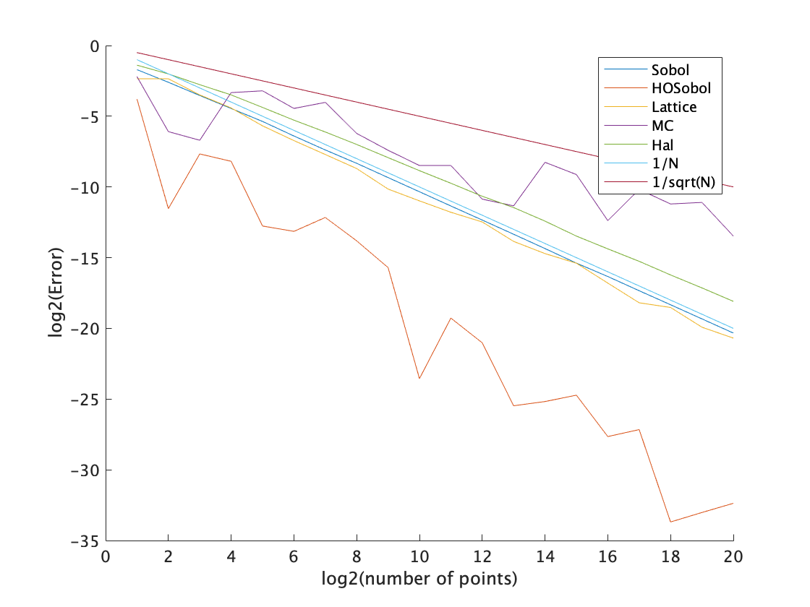

# SGsurvey_experiment
本ページは、サーベイ論文「準モンテカルロ積分の最前線」（鈴木航介・合田隆）のサンプルコードを掲載しているページです。
本ページのコードの目的は積分誤差の収束オーダーを確認することであり、計算速度は妥協しているところがあります。たとえば、
- open な積分則なのに計算結果を再利用していない場合があります。
- 2 階の Sobol' 列などで、低速なスクリプトを使用しています。

## リポジトリの構造
- スクリプト
	- experiment.m: 各種QMC点集合によるQMC積分誤差をプロットするスクリプト
	- experiment_random.m: 乱択化QMCの分散をプロットするスクリプト
	- experiment_higher.m: Section 6.3 の実験（高次の収束を確認する）に特化したスクリプト
	- other_experiments: Sobol列、Halton列、格子の各種バリアントに特化したスクリプト群
		- experiment_Sobol.m: Sobol列に特化したスクリプト
		- experiment_Halton.m: Halton列に特化したスクリプト
		- experiment_lattice.m: lattice列に特化したスクリプト
- 関数
	- Errors.m: 被積分関数とQMC点集合の種類を指定して、QMC積分誤差の配列を返す関数
	- RQMCErrors.m: 被積分関数とQMC点集合の種類を指定して、乱択化QMCの分散の配列を返す関数
	- integrands: 利用可能な被積分関数群（詳細は利用可能なパラメータの被積分関数の項を参照）
	- LatticePoint.m: 格子生成のための関数（後述のDirk Nuyens先生の実装に関するwrapper）
	- LatticePoint_diag.m: 格子生成のための関数（後述のDirk Nuyens先生の実装に関するwrapper）

## 利用可能なパラメータ（QMC点集合・被積分関数）
### 被積分関数(integ)
g_i は weight（i 番目の座標の重要度）を表す

- expsum: f(x) = exp(sum(g_j x_j))
- cossum: f(x) = cos(2pi+sum(g_j x_j))
- prodroot: f(x) = (1+1/s)^s*prod(x_i^{1/s})-1
- half_of_cube: f(x) =  1/2 if sum(x) < s/2 else -1/2

以下では、被積分関数の形は f(x) = prod(1 + g_i h(x_i)) -1 
- Sobolev_c: h(x, c) = x^{c} - 1/(1+c)
- Discontinuous: h(x, c) = 1-c if x_j < c else -c
- Bernoulli2: h(x) = B_2(x) = x^2-x+1/6
- Bernoulli3: h(x) = B_3(x) = x^3-3x^2/2+x/2
- Bernoulli4: h(x) = B_4(x) = x^4-2x^3+x^2-1/30 
- Bernoulli6: h(x) = B_6(x) = x^6-3x^5+5x^4/2-x^2/2+1/42
- G_function: h(x) = |4x_j-2|-1
- absconti3: h(x) = (1+3(x-|1-3x|))/2
- conti3_nonper: h(x) = (|1-3x|-3x+4)/5 


### Errors 関数（experiment.m・experiment_higher.m）で利用可能なQMC点集合:
対応している点列は、Errors.m および RQMCErrors.m 上部にも記載している。組み込み関数以外を使用している部分についてはリポジトリに含まれていないため，使用する場合は別途導入する必要がある。
- Sobol'列: Statistics and Machine Learning Toolboxの組み込み関数 sobolset(s) を使用。
	- "Sobol" 
	- "Sobol+shift": non-digital なシフトをするSobol列
	- "ScrambledSobol"
	- "HOSobol": [Josef Dick先生の実装](https://quasirandomideas.wordpress.com/2010/06/17/how-to-generate-higher-order-sobol-points-in-matlab-and-some-numerical-examples/)による2-order Sobol列を返す関数 HOSobol 使用する（要インストール）
- Halton列: Statistics and Machine Learning Toolboxの組み込み関数 haltonset(s) を使用
	- "Halton"
	- "LeapedHalton"
	- "ScrambledHalton"
- 格子: Dirk Nuyens先生の実装を使用する（要インストール）。
	- "Lattice": [Dirk Nuyens先生の実装](https://people.cs.kuleuven.be/~dirk.nuyens/fast-cbc/)を利用した2^m に近い素数点からなる（よい）格子を使用する。
	- "badLattice": [Dirk Nuyens先生の実装](https://people.cs.kuleuven.be/~dirk.nuyens/fast-cbc/)を利用した2^m に近い素数点からなる（わるい）格子を使用する。
	- "Lattice+shift":（要インストール）
	- "Lattice_seq": [Dirk Nuyens先生の実装](https://people.cs.kuleuven.be/~dirk.nuyens/qmc-generators/)による格子列を返す関数 latticeseq_b2 を使用。
- 一様ランダム:
	- "Random": 組み込み関数 rand を使用

### RQMCErrors 関数（experiment_random.m）で利用可能なQMC点集合（詳細はErrorsで利用可能なQMC点集合と同様）:
- "Sobol+shift": non-digital なシフトをするSobol列
- "Lattice+shift":（要インストール）
- "Random": 組み込み関数 rand を使用

## 導入方法
- このリポジトリをcloneしてください。
- 非組込み関数を利用するために，以下の手順でソースコードをダウンロードし，サンプルコードと同じフォルダにコピーしてください（利用しない場合はこの手順は不要ですが，ダウンロードした時点でのサンプルソースの時点では利用しています）:
	- Dick先生のblog（ https://quasirandomideas.wordpress.com/2010/06/17/how-to-generate-higher-order-sobol-points-in-matlab-and-some-numerical-examples/ ）にある *Matlab function for generating higher order Sobol points* に書かれているMATLABのソースコードをコピーし，サンプルコードと同じフォルダに「HOSobol.m」という名前で保存してください。
		- 補足: 2020/06_22現在，このソースコードは21行目にミス（「-」が「–」になっている）があるので，MATLABの指示に従って修正してください。以下に修正した正しいソースコードも提示します
		```
		Y(j,:) = bitset( Y(j,:),(m*d+1) - k - (i-1)*d,bitget( Z((j-1)*d+k,:),(m+1) - i));
		```
	- Dirk Nuyens先生のwebページ（ https://people.cs.kuleuven.be/~dirk.nuyens/fast-cbc/ ）から，以下のファイルをダウンロードしてサンプルコードと同じフォルダにコピーしてください。
		- fastrank1pt.m
		- generatorp.m
		- powmod.m
	- Dirk Nuyence先生のwebページ（ https://people.cs.kuleuven.be/~dirk.nuyens/qmc-generators/ ）から，以下のファイルをダウンロードしてサンプルコードと同じフォルダにコピーしてください。
		- latticeseq_b2.m,
		- bitreverse32.m
- 導入ができたことを確認するために，「experiment.m」を開いて実行した際に，以下の画像のような感じで出力されれば成功です。


